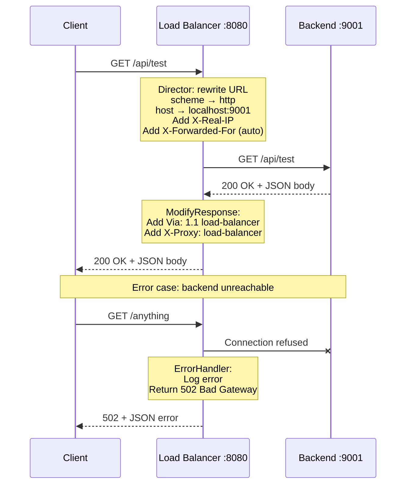

# Phase 1: Basic Reverse Proxy

## Overview

A reverse proxy sits between clients and backend servers, forwarding requests on behalf of clients. It's the foundational building block for load balancers, API gateways, and service meshes.

## Architecture

```
┌──────────┐         ┌──────────────┐         ┌──────────────┐
│  Client   │──HTTP──▶│ Load Balancer │──HTTP──▶│   Backend    │
│  (curl)   │◀──────── │  :8080       │◀──────── │   :9001     │
└──────────┘         └──────────────┘         └──────────────┘
```

## Request Lifecycle



## Package Responsibilities

| Package | Responsibility |
|---------|---------------|
| `internal/config` | YAML parsing, validation, defaults |
| `internal/proxy` | Reverse proxy logic (Director, ModifyResponse, ErrorHandler) |
| `internal/server` | HTTP server lifecycle, signal handling, graceful shutdown |
| `cmd/loadbalancer` | Composition root — wires everything together |
| `cmd/backend` | Test backend simulator |

## Key Design Decisions

### 1. httputil.ReverseProxy as Foundation
We wrap Go's standard `httputil.ReverseProxy` rather than building from scratch. This gives us battle-tested handling of hop-by-hop headers, chunked encoding, streaming, and WebSocket upgrades. Traefik uses the same approach.

### 2. Custom Transport
The default `http.Transport` has no limits and no timeouts. Our custom transport configures:
- **MaxIdleConns=100**: Prevents connection exhaustion
- **MaxIdleConnsPerHost=10**: Per-backend connection limit
- **IdleConnTimeout=90s**: Releases stale connections
- **DialTimeout=30s**: Fails fast on unreachable backends
- **ResponseHeaderTimeout=30s**: Detects stuck backends

### 3. Composition over Inheritance
`ReverseProxy` wraps (doesn't embed) `httputil.ReverseProxy` to control the public API surface. This is idiomatic Go — expose what you need, hide what you don't.

### 4. Structured JSON Errors
The ErrorHandler returns JSON (`{"error": "bad gateway", ...}`) rather than plain text. API clients can parse this programmatically.

## Headers Added by the Proxy

| Header | Value | Purpose |
|--------|-------|---------|
| `X-Forwarded-For` | Client IP | Tells backend the original client IP (added automatically by httputil) |
| `X-Real-IP` | Client IP | Simpler alternative to X-Forwarded-For |
| `Via` | `1.1 load-balancer` | RFC 7230 §5.7.1 — indicates the response passed through a proxy |
| `X-Proxy` | `load-balancer` | Custom identification header |

## Performance Baseline

```
BenchmarkProxy_ServeHTTP-8    ~27,000 iterations    ~43μs/op    ~40KB/op    93 allocs/op
```

This is our Phase 1 baseline. We'll track regressions as we add middleware in later phases.

## Future Improvements

- Multiple backends (Phase 2)
- Request/response middleware chain
- Connection pool metrics
- Configurable header forwarding policy (preserve original Host vs. rewrite)
- HTTP/2 downstream support
