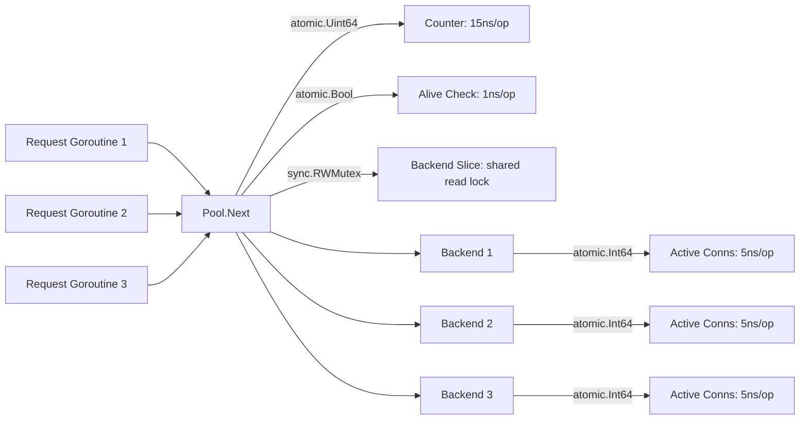

# Phase 2: Multiple Backend Support

## Overview

Phase 2 transforms the load balancer from a single-backend reverse proxy into a true load balancer that distributes traffic across multiple backends using round-robin selection.

## Architecture

```
┌──────────┐         ┌──────────────┐         ┌──────────────┐
│          │         │              │    ┌────▶│  Backend 1   │
│  Client  │──HTTP──▶│ Load Balancer│────┤    │  :9001       │
│          │◀──────── │  :8080       │    │    └──────────────┘
└──────────┘         │              │    │    ┌──────────────┐
                     │  ┌────────┐  │    ├───▶│  Backend 2   │
                     │  │  Pool  │  │    │    │  :9002       │
                     │  │(RR)    │──┘    │    └──────────────┘
                     │  └────────┘       │    ┌──────────────┐
                     │              │    └───▶│  Backend 3   │
                     └──────────────┘         │  :9003       │
                                              └──────────────┘
```

## Package Responsibilities

| Package | Responsibility |
|---------|---------------|
| `internal/pool` | **NEW** — Backend struct, BackendPool interface, RoundRobinPool |
| `internal/proxy` | **REFACTORED** — Thin orchestrator using BackendPool |
| `internal/config` | **MODIFIED** — Multiple backends with name, weight, max_connections |
| `internal/server` | Unchanged — HTTP server lifecycle |
| `cmd/loadbalancer` | **MODIFIED** — Wires pool from config |
| `cmd/backend` | Unchanged — Backend simulator |

## Concurrency Design



| State | Primitive | Why |
|-------|-----------|-----|
| Round-robin counter | `atomic.Uint64` | Lock-free, ~15ns/op, no goroutine ever blocks |
| Backend alive | `atomic.Bool` | Read-heavy (every request), lock-free reads |
| Active connections | `atomic.Int64` | Increment/decrement every request, lock-free |
| Backend list | `sync.RWMutex` | Rarely written (config reload), many concurrent readers |

## Key Design Decisions

### 1. Per-Backend ReverseProxy & Transport
Each backend gets its own `httputil.ReverseProxy` and `http.Transport`. A slow backend exhausts only its own connection pool, not the shared pool.

### 2. BackendPool Interface
```go
type BackendPool interface {
    Next(r *http.Request) *Backend
    Backends() []*Backend
}
```
Phase 3 algorithms (LeastConnections, Weighted, IPHash) implement this interface. The proxy doesn't change.

### 3. 503 vs 502 Distinction
- **503 Service Unavailable**: No healthy backends in the pool
- **502 Bad Gateway**: A backend was selected but couldn't be reached

This distinction matters for client retry logic and alerting.

## Performance Baseline

| Benchmark | ops/sec | ns/op | B/op | allocs/op |
|-----------|---------|-------|------|-----------|
| Pool.Next (sequential) | ~78M | 15 | 0 | 0 |
| Pool.Next (parallel, 8 cores) | ~11M | 110 | 0 | 0 |
| Full proxy path | ~27k | 44,175 | 40,930 | 96 |

Pool selection adds **15ns** of overhead per request — negligible compared to the ~44μs full proxy path.

## Future Improvements

- Phase 3: Additional algorithms (LeastConnections, Weighted, IPHash, Random)
- Phase 4: Health checks to automatically toggle backend alive status
- Phase 5: Dynamic backend addition/removal via API
- Connection pool metrics per backend
