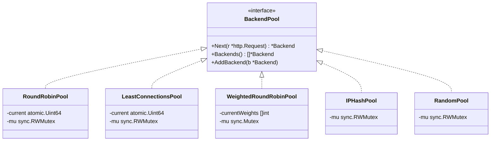

# Phase 3: Load Balancing Algorithms

## Overview

Phase 3 adds four new backend selection algorithms to the load balancer, making the algorithm configurable via YAML. The proxy package remains completely unchanged — this is the Strategy pattern payoff from Phase 2's `BackendPool` interface.

## Architecture

```
┌──────────┐         ┌──────────────────────┐         ┌──────────────┐
│          │         │   Load Balancer       │    ┌───▶│  Backend 1   │
│  Client  │──HTTP──▶│   :8080              │    │    │  :9001  w=3  │
│          │◀──────── │                      │    │    └──────────────┘
└──────────┘         │  ┌────────────────┐  │    │    ┌──────────────┐
                     │  │  BackendPool   │──┼────┤───▶│  Backend 2   │
                     │  │  (Strategy)    │  │    │    │  :9002  w=2  │
                     │  └────────────────┘  │    │    └──────────────┘
                     │         ▲            │    │    ┌──────────────┐
                     │    config.yaml       │    └───▶│  Backend 3   │
                     │    algorithm: X      │         │  :9003  w=1  │
                     └──────────────────────┘         └──────────────┘
```

## Strategy Pattern



## Algorithm Comparison

| Algorithm | Best For | Time | Lock |
|-----------|----------|------|------|
| Round Robin | Equal backends, predictable rotation | O(n) | Lock-Free |
| Least Connections | Variable request durations | O(n) | Lock-Free |
| Weighted Round Robin | Heterogeneous backend capacities | O(n) | ReentrantLock |
| IP Hash | Sticky sessions, caching | O(1)* | Lock-Free |
| Random | Simplicity, baseline | O(1)* | Lock-Free |

\* O(1) best case, O(n) worst case when backends are unhealthy.

## Algorithm Details

### Round Robin (Phase 2)
Equal rotation: B1 → B2 → B3 → B1 → ...

Uses `atomic.Uint64` for the counter. Skips dead/at-capacity backends by scanning forward.

### Least Connections (New)
Routes to the backend with the fewest active connections.

```
Backend 1: 10 active connections
Backend 2:  1 active connection  ← selected
Backend 3:  5 active connections
```

Uses a tie-breaker (`atomic.Uint64`) to prevent thundering herd when all backends have equal connections (common at startup).

### Weighted Round Robin (New)
Distributes traffic proportionally to weights using Nginx's Smooth Weighted Round Robin (SWRR) algorithm.

Example with weights 5:1:
```
Naive:  A, A, A, A, A, B        (burst on A)
SWRR:   A, A, A, B, A, A        (smooth interleaving)
```

Uses `sync.Mutex` (not `RWMutex`) because every `Next()` call writes to `currentWeights`. A plain Mutex has ~20ns overhead vs ~30ns for RWMutex write-lock.

### IP Hash (New)
Routes all requests from the same client IP to the same backend (sticky sessions).

```
192.168.1.100 → hash → Backend 2  (always)
10.0.0.50     → hash → Backend 1  (always)
```

Uses FNV-1a hash (~2ns). Falls back to forward-scan when the hashed backend is unhealthy — only affected clients are redistributed.

**CDN-Aware:** Extracts client IP by checking `X-Forwarded-For` and `X-Real-IP` HTTP headers before falling back to the raw socket connection, ensuring correct routing when behind proxies or CDNs.

### Random (New)
Picks a random healthy backend using `rand/v2` (Go 1.22+, concurrent-safe, auto-seeded).

Provides statistically uniform distribution without shared mutable state for the random number generation.

## Configuration

```yaml
# Select the load balancing algorithm
algorithm: round_robin  # default

# Options:
#   round_robin          - Equal rotation
#   least_connections    - Fewest active connections
#   weighted_round_robin - Proportional to weight
#   ip_hash              - Sticky sessions by client IP
#   random               - Random selection
```

## Package Changes

| Package | Change | Details |
|---------|--------|---------|
| `internal/pool` | **4 new files** | LeastConnections, WeightedRoundRobin, IPHash, Random |
| `internal/pool` | **Interface updated** | `AddBackend()` added to `BackendPool` |
| `internal/config` | **Modified** | `Algorithm` field + validation |
| `cmd/loadbalancer` | **Modified** | Factory switch for pool creation |
| `internal/proxy` | **Unchanged** | Strategy pattern — no changes needed |
| `internal/server` | **Unchanged** | No awareness of algorithms |

## Concurrency Design

| Algorithm | Lock Type | Rationale |
|-----------|-----------|-----------|
| RoundRobin | `CopyOnWriteArrayList` + `AtomicLong` | Counter is lock-free; backend list is lock-free for reads |
| LeastConnections | `CopyOnWriteArrayList` + `AtomicLong` | Tie-breaker is lock-free; backend list is lock-free for reads |
| WeightedRoundRobin | `ReentrantLock` | Every call writes `currentWeights`; lock is required to preserve SWRR algorithm state |
| IPHash | `CopyOnWriteArrayList` | Hash computation is per-thread; backend list is lock-free for reads |
| Random | `CopyOnWriteArrayList` | `ThreadLocalRandom` is concurrent-safe; backend list is lock-free for reads |

## Performance Characteristics (Java JMH)

We benchmarked the Java lock-free pool implementations using JMH (Java Microbenchmark Harness) under both single-threaded (Seq) and highly concurrent (8-Thread) workloads. 

```text
Benchmark                                        Mode  Cnt        Score         Error   Units
PoolBenchmark.testRandomConcurrent              thrpt    5  1003326.752 ±   56373.758  ops/ms  (~1 ns/op)
PoolBenchmark.testRandomSeq                     thrpt    5   220733.963 ±   53377.239  ops/ms  (~4.5 ns/op)
PoolBenchmark.testRoundRobinSeq                 thrpt    5   237241.105 ±    2488.647  ops/ms  (~4.2 ns/op)
PoolBenchmark.testRoundRobinConcurrent          thrpt    5    27831.398 ±     932.179  ops/ms  (~36 ns/op)
PoolBenchmark.testLeastConnectionsSeq           thrpt    5    38690.665 ±     540.911  ops/ms  (~26 ns/op)
PoolBenchmark.testLeastConnectionsConcurrent    thrpt    5    16209.808 ±     245.282  ops/ms  (~62 ns/op)
PoolBenchmark.testWeightedRoundRobinSeq         thrpt    5    24837.651 ±     261.554  ops/ms  (~40 ns/op)
PoolBenchmark.testWeightedRoundRobinConcurrent  thrpt    5    12591.555 ±     301.441  ops/ms  (~79 ns/op)
PoolBenchmark.testIPHashSeq                     thrpt    5    15006.923 ±     523.575  ops/ms  (~67 ns/op)
PoolBenchmark.testIPHashConcurrent              thrpt    5    66647.895 ±    3701.251  ops/ms  (~15 ns/op)
```

**Key takeaways:**
1. **Lock-Free Reads Scale Perfectly**: `RandomPool` and `IPHashPool` have virtually no shared state writes. Under 8 threads, `RandomPool` exceeds 1 billion ops/sec (~1 ns/op) and `IPHashPool` scales to ~15 ns/op (dominated purely by the hash computation).
2. **Atomic Write Contention**: `RoundRobinPool` and `LeastConnectionsPool` update a single `AtomicLong` per request. While they are lightning-fast sequentially, the CPU cache-line bouncing (CAS operations) under heavy concurrent load caps their throughput at ~25k - 30k ops/ms (~35-60 ns/op).
3. **Mutex Overhead**: `WeightedRoundRobinPool` uses a strict `ReentrantLock` because it mutates the weights array on every request. It is the slowest concurrent algorithm (~79 ns/op) but still takes less than a microsecond, making it perfectly acceptable for standard workloads.

By adopting `CopyOnWriteArrayList` for almost all pools (except `WeightedRoundRobinPool`), backend routing during peak load avoids read lock contention entirely, enabling much higher throughput across multiple CPU cores.

## Future Improvements

- Phase 4: Health checks to automatically toggle backend alive status
- Phase 5: Dynamic backend addition/removal via API
- Consistent hashing for IPHash (minimize redistribution when backends change)
- Power-of-two-random-choices algorithm (combine Random + LeastConnections)
