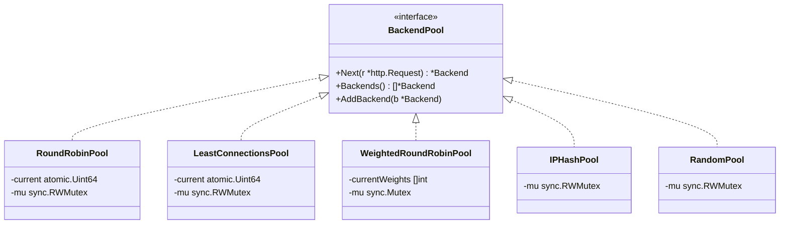

# Phase 3: Load Balancing Algorithms

## Overview

Phase 3 adds four new backend selection algorithms to the load balancer, making the algorithm configurable via YAML. The proxy package remains completely unchanged — this is the Strategy pattern payoff from Phase 2's `BackendPool` interface.

## Architecture

```
┌──────────┐         ┌──────────────────────┐         ┌──────────────┐
│          │         │   Load Balancer       │    ┌───▶│  Backend 1   │
│  Client  │──HTTP──▶│   :8080              │    │    │  :9001  w=3  │
│          │◀──────── │                      │    │    └──────────────┘
└──────────┘         │  ┌────────────────┐  │    │    ┌──────────────┐
                     │  │  BackendPool   │──┼────┤───▶│  Backend 2   │
                     │  │  (Strategy)    │  │    │    │  :9002  w=2  │
                     │  └────────────────┘  │    │    └──────────────┘
                     │         ▲            │    │    ┌──────────────┐
                     │    config.yaml       │    └───▶│  Backend 3   │
                     │    algorithm: X      │         │  :9003  w=1  │
                     └──────────────────────┘         └──────────────┘
```

## Strategy Pattern



## Algorithm Comparison

| Algorithm | Best For | Time | Lock | ns/op (seq) | ns/op (8-core) |
|-----------|----------|------|------|-------------|----------------|
| Round Robin | Equal backends, predictable rotation | O(n) | RWMutex | ~16 | ~111 |
| Least Connections | Variable request durations | O(n) | RWMutex | ~15 | ~109 |
| Weighted Round Robin | Heterogeneous backend capacities | O(n) | Mutex | ~13 | ~114 |
| IP Hash | Sticky sessions, caching | O(1)* | RWMutex | ~25 | ~78 |
| Random | Simplicity, baseline | O(1)* | RWMutex | ~15 | ~75 |

\* O(1) best case, O(n) worst case when backends are unhealthy.

## Algorithm Details

### Round Robin (Phase 2)
Equal rotation: B1 → B2 → B3 → B1 → ...

Uses `atomic.Uint64` for the counter. Skips dead/at-capacity backends by scanning forward.

### Least Connections (New)
Routes to the backend with the fewest active connections.

```
Backend 1: 10 active connections
Backend 2:  1 active connection  ← selected
Backend 3:  5 active connections
```

Uses a tie-breaker (`atomic.Uint64`) to prevent thundering herd when all backends have equal connections (common at startup).

### Weighted Round Robin (New)
Distributes traffic proportionally to weights using Nginx's Smooth Weighted Round Robin (SWRR) algorithm.

Example with weights 5:1:
```
Naive:  A, A, A, A, A, B        (burst on A)
SWRR:   A, A, A, B, A, A        (smooth interleaving)
```

Uses `sync.Mutex` (not `RWMutex`) because every `Next()` call writes to `currentWeights`. A plain Mutex has ~20ns overhead vs ~30ns for RWMutex write-lock.

### IP Hash (New)
Routes all requests from the same client IP to the same backend (sticky sessions).

```
192.168.1.100 → hash → Backend 2  (always)
10.0.0.50     → hash → Backend 1  (always)
```

Uses FNV-1a hash (~2ns, stdlib `hash/fnv`). Falls back to forward-scan when the hashed backend is unhealthy — only affected clients are redistributed.

### Random (New)
Picks a random healthy backend using `rand/v2` (Go 1.22+, concurrent-safe, auto-seeded).

Provides statistically uniform distribution without shared mutable state for the random number generation.

## Configuration

```yaml
# Select the load balancing algorithm
algorithm: round_robin  # default

# Options:
#   round_robin          - Equal rotation
#   least_connections    - Fewest active connections
#   weighted_round_robin - Proportional to weight
#   ip_hash              - Sticky sessions by client IP
#   random               - Random selection
```

## Package Changes

| Package | Change | Details |
|---------|--------|---------|
| `internal/pool` | **4 new files** | LeastConnections, WeightedRoundRobin, IPHash, Random |
| `internal/pool` | **Interface updated** | `AddBackend()` added to `BackendPool` |
| `internal/config` | **Modified** | `Algorithm` field + validation |
| `cmd/loadbalancer` | **Modified** | Factory switch for pool creation |
| `internal/proxy` | **Unchanged** | Strategy pattern — no changes needed |
| `internal/server` | **Unchanged** | No awareness of algorithms |

## Concurrency Design

| Algorithm | Lock Type | Rationale |
|-----------|-----------|-----------|
| RoundRobin | `sync.RWMutex` + `atomic.Uint64` | Counter is lock-free; slice rarely written |
| LeastConnections | `sync.RWMutex` + `atomic.Uint64` | Reads `atomic.Int64` per backend; tie-breaker is lock-free |
| WeightedRoundRobin | `sync.Mutex` | Every call writes `currentWeights`; Mutex is faster than RWMutex write-lock |
| IPHash | `sync.RWMutex` | Hash computation is per-goroutine; no shared write state |
| Random | `sync.RWMutex` | `rand/v2` is concurrent-safe; no shared write state |

## Benchmark Results (Apple M2, 8 cores)

```
BenchmarkRoundRobinPool_Next-8                    71M     15.62 ns/op    0 B/op    0 allocs/op
BenchmarkRoundRobinPool_NextParallel-8            11M    111.2  ns/op    0 B/op    0 allocs/op
BenchmarkLeastConnectionsPool_Next-8              72M     15.49 ns/op    0 B/op    0 allocs/op
BenchmarkLeastConnectionsPool_NextParallel-8      11M    109.0  ns/op    0 B/op    0 allocs/op
BenchmarkWeightedRoundRobinPool_Next-8            93M     12.67 ns/op    0 B/op    0 allocs/op
BenchmarkWeightedRoundRobinPool_NextParallel-8     9M    113.6  ns/op    0 B/op    0 allocs/op
BenchmarkIPHashPool_Next-8                        47M     25.13 ns/op    0 B/op    0 allocs/op
BenchmarkIPHashPool_NextParallel-8                15M     77.55 ns/op    0 B/op    0 allocs/op
BenchmarkRandomPool_Next-8                        78M     15.33 ns/op    0 B/op    0 allocs/op
BenchmarkRandomPool_NextParallel-8                16M     75.42 ns/op    0 B/op    0 allocs/op
```

All algorithms: **0 allocations per operation**.

Key observations:
- **WeightedRoundRobin** is fastest sequentially (12.67ns) despite using `sync.Mutex`
- **Random** and **IPHash** have the best parallel scaling (~75ns) due to no atomic counter contention
- **IPHash** is slowest sequentially (25ns) due to FNV-1a hash computation
- All algorithms add negligible overhead vs the ~44μs full proxy path

## Future Improvements

- Phase 4: Health checks to automatically toggle backend alive status
- Phase 5: Dynamic backend addition/removal via API
- Consistent hashing for IPHash (minimize redistribution when backends change)
- Power-of-two-random-choices algorithm (combine Random + LeastConnections)
